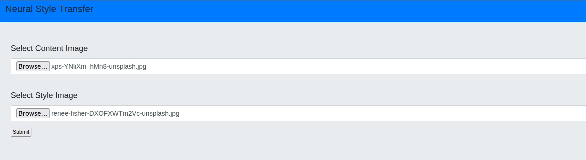
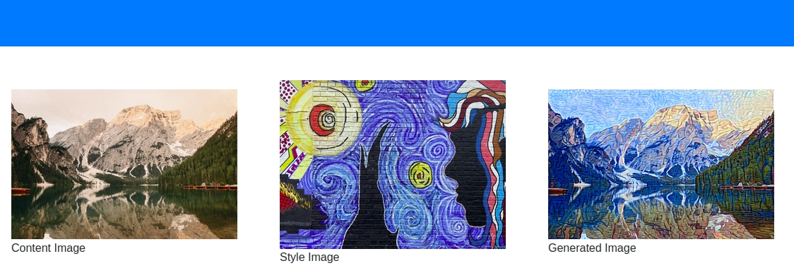

# Neural Style Transfer

* This project is based on Leon Gatys's paper ["A Neural Algorithm of Artistic Style"](https://arxiv.org/abs/1508.06576).

* full code base explanation is available [here](https://www.kaggle.com/billiemage/style-transfer-with-deep-neural-networks).

## How to run this project ?

for running this project in your local machine you need follow 5 steps:

* clone this repository in any folder of system by running this:-

        git clone https://github.com/Justsubh01/StyleTransfer.git

* Make new virtual environment by running this:-

        python3 -m venv name_of_environment

And then activate the environment by:-

        source name_of_environment/bin/activate

(this step is recommended not required, because it is good practice to isolate all project resources from each other)

* Install all required packages by running this :-

        pip install -r requirements.txt

(Make sure you are in project dir `StyleTransfer`)

* And the last step is to run the `main.py` file by :-

        python main.py

* The last step is to go to your browser and search `localhost:5000/`.

### Result:-

